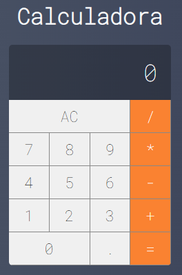

# CALCULADORA-REACT

# Sobre o projeto

Calculadora desenvolvida em React, versão aprimorada do curso Web-Moderno da Cod3r.

- Alterado o uso do Eval
- Corrigido o erro ao pressionar ponto(.) duas vezes
- Valores arredondados em duas casas


## Imagem da Calculadora

### Calculadora



# 🚀 Começando

Essas instruções permitirão que você obtenha uma cópia do projeto em operação na sua máquina local para fins de desenvolvimento e teste.

## 📋 Pré-requisitos

- npm / yarn

## 🔧 Instalação
### :warning::warning: **O arquivo calculadora.png**: é a imagem usada no readme.md! Apagar o arquivo depois do clone :warning::warning:
``` bash
### clonar repositório
git clone https://github.com/PauloCSantos/calculator-react.git

## entrar na pasta do projeto
cd calculadora

## instalar as dependencias
npm install

## executar o projeto
npm start
```

## 🛠️ Construído com

- HTML / CSS  
- ReactJS

## ✒️ Autor

* **Paulo C Santos** - [Linkedin](https://www.linkedin.com/in/paulocsantos1995/)

## 🖐️ Agradecimento

Agradeço a equipe Cod3r e ao professor Leonardo pelo maravilhoso curso de Web-Moderno 

-Link do curso: https://www.udemy.com/course/curso-web/
